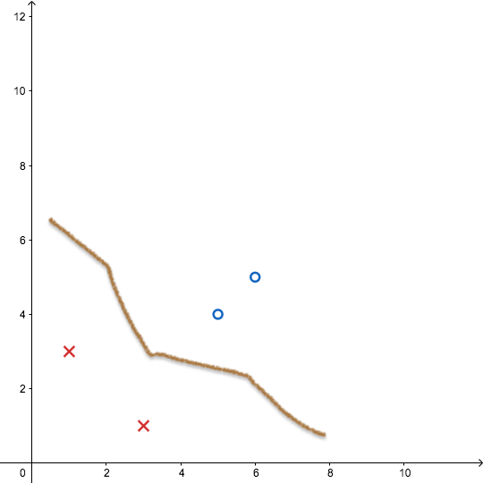
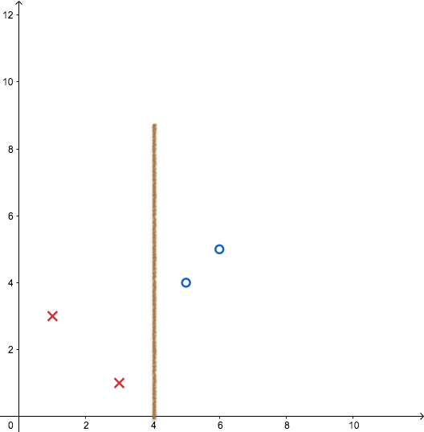
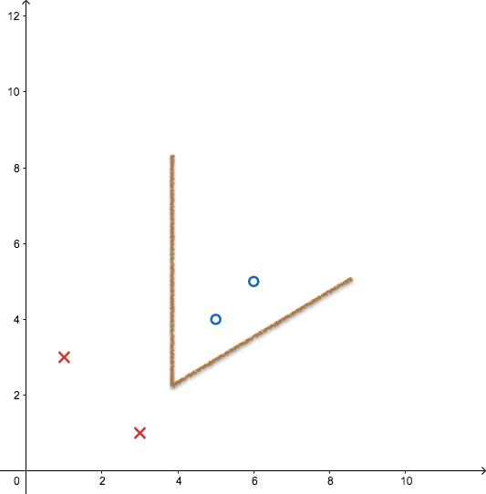
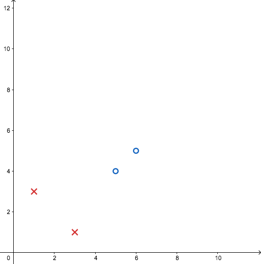
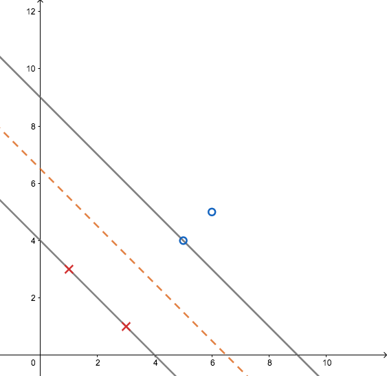
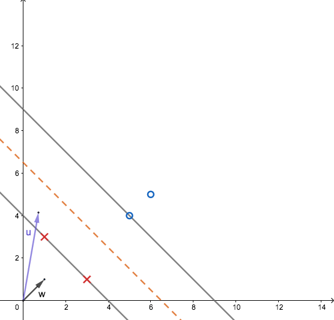
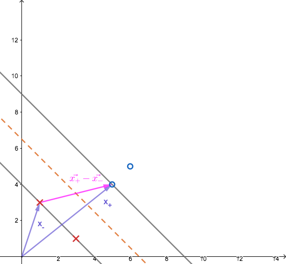
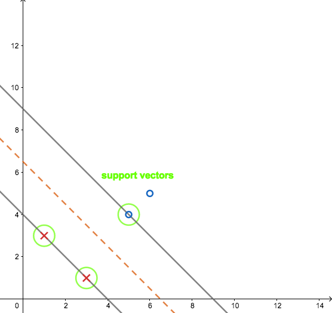

# Support Vector Machine

## Decision Boundary

- Nearest Neighbor

- ID Tree

- Neural Network

**WHEN STUCK, SWITCH TO ANOTHER PERSPECTIVE**

---

## Support Vector Machine

Early '90s [Vladimir Vapnik](https://en.wikipedia.org/wiki/Vladimir_Vapnik) introduced the ideas, [SVM(Support Vector Machine)](https://en.wikipedia.org/wiki/Support_vector_machine).

- If we want to distinguish between '+' and '-' samples, how should we divide it?
- If you draw a line and divide it, what line should it be?

The easiest and most intuitive answer is probably the following line (dotted line) with some lines that use the widest distance between the '+' and '-' samples.

The most intuitive way is putting in **the widest street** that separates the positive samples from the negative samples. Therefore to separate the fittest way is to find *the widest street approach(street is wide as possible)*.

SVM is the process of solving the above question. I will introduce how to set up and solve problems from this point of view.

### 1. Decision Rule

Let's think about *"what should be the decision rule to decide the decision boundary?"*

- The $\vec{w}$ is perpendicular to the median line of the street. 

- $\vec{u}$ is an unknown sample which is left side or right side of the street.

What we are wondering is whether the unknown sample, $\vec{u}$ , belongs on the righ or left side of the street.

$$
\vec{w} \cdot \vec{u} ≥ c
$$
One way we can do this is to make sure that the value is greater than the constant `c` after we used inner product of $\vec{w}$ and $\vec{u}$. In the range not exceeding the generality, it can be expressed as follows:
$$
\begin{equation}
\vec{w} \cdot \vec{u} + b ≥ 0 \qquad\text{THEN Positive sample}
\tag{1}\label{eq:1}
\end{equation}
$$

Logic is very simple. It is easy to understand that the inner product is to project $\vec{u}$ to $\vec{w}$ in the above plot, and it is easy to think that the length is long and it goes to the right if it goes beyond the boundary and to the left if it is shorter.

Therefore, the above equation $\eqref{eq:1}$ becomes our **decision rule**. It is also the first tool we need to understand SVM, but there are still a lot of deficiencies. Yet, we have no idea what $\vec{w}$ should be set in that formula or what $b$ should be set. We but can only know that $\vec{w}$ is orthogonal to the median line of the street we want.

Unfortunately, such a $\vec{w}$ could be drawn in a wide variety of ways, so the judgment I can make here is still lacking of constraints. So what we are going to do is to add several constraints to the formula so that we can compute  $\vec{w}$ and $b$.

### 2. Generalization

#### Design and add additional constraints

Let's say $x_+$ is a positive(+) sample and $x_-$ is a negative(-) sample.
$$
\vec{w} \cdot \vec{x_+} + b ≥ 1 \;\;\;\;\;\;\text{positive sample}\\ 
\vec{w} \cdot \vec{x_-} + b ≤ -1 \;\;\;\;\text{negative sample}
$$
Dealing with two expressions is annoying. So we will design a variable here and generalize it to one expression.
$$
y_i \;\text{such that} \;y_i = 
  \begin{cases} 
   +1 & \text{for positive sample} \\
   -1       & \text{for negative sample}
  \end{cases}
$$
Now let's multiply this $y_i$ by the formula above.
$$
\begin{equation}
y_i(\vec{w}\cdot\vec{x_i}+b)≥1 \tag{2}\label{eq:2}
\end{equation}
$$

#### Generalization

In other words, the result of the formula for two samples, '+' and '-', that will be on the boundary (gray lines; gutters).
$$
\begin{equation}
y_i(\vec{w}\cdot\vec{x_i}+b)-1=0\\
\text{For}\; x_i \; \text{in gutter}
\tag{3}\label{eq:3}
\end{equation}
$$

### 3. Width

What we want to do is to set a line and to maximize the distance between the resulting '+' and '-' samples. Then we have to think about how we can create 'street'.

#### What's the width of the street?

If I had a unit vector in that direction, then I could just dot the two together, that would be the width.
$$
\begin{align}
\text{WIDTH}=
&
(\vec{x_+}-\vec{x_-})\cdot\frac{\vec{w}}{\lVert{\vec{w}}\rVert}\\
&
= \frac{2}{\lVert{\vec{w}}\rVert}
\end{align}
\tag{4}\label{eq:4}
$$

The equation $\eqref{eq:4}$ above is the third tool we need to understand SVM.

#### Optimization techniques

The goal of maximizing $\text{WIDTH}$ can be described as follows:

- Qudaratic Programing

$$
\begin{align}
\max\frac{2}{\lVert{w}\rVert}
&
\Rightarrow
\max\frac{1}{\lVert{w}\rVert}\\
&
\Rightarrow
\min\lVert{w}\rVert\\
&
\Rightarrow
\min\frac{1}{2}\lVert{w}\rVert^2\\
\end{align}
$$

- Lagrange Multiplier Method (1802)
  - we can maximize or minimize without thinking about the constraints anymore
  - $\alpha$ is the Lagrange multiplier

$$
\begin{equation}
L=\frac{1}{2}\lVert{w}\rVert^2-\sum_i\alpha_i[y_i(\vec{w}\cdot\vec{x_i}+b)-1] 
\tag{5}\label{eq:5}
\end{equation}
$$

Differenciation perspective to $\vec{w}$:

$$
\begin{equation}
\frac{dL}{d\vec{w}}=\vec{w}-\sum_i\alpha_iy_i\vec{x_i}=0
\end{equation}
$$

Set to zero:
$$
\begin{equation}
\vec{w}=\sum_i\alpha_iy_i\vec{x_i}
\tag{6}\label{eq:6}
\end{equation}
$$

It tells us that the $\vec{w}$ is a linear sum of samples (all or some). The $\vec{w}$ is going to be a linear some of these vectors(in the sample set, because for some $\alpha$ will be 0)

Differenciation perspective to $b$: 
$$
\frac{dL}{db}=-\sum_i\alpha_iy_i=0
$$
Set to zero:
$$
\begin{equation}
\sum_i\alpha_iy_i=0
\tag{7}\label{eq:7}
\end{equation}
$$

Now, using the equations we obtained here, we will plug in $\eqref{eq:5}$ for the equation for $\alpha$ and simplify the problem.
$$
L=\frac{1}{2}
\left(\sum_i\alpha_iy_i\vec{x_j}\right)
\left(\sum_j\alpha_jy_j\vec{x_j}\right)
-
\left(\sum_i\alpha_iy_i\vec{x_j}\right)
\cdot
\left(\sum_j\alpha_jy_j\vec{x_j}\right)
-
b\sum_i\alpha_iy_i
+\sum_i\alpha_i
$$

because the $\sum_i\alpha_iy_i$ is zero: 
$$
L=\frac{1}{2}
\left(\sum_i\alpha_iy_i\vec{x_j}\right)
\left(\sum_j\alpha_jy_j\vec{x_j}\right)
-
\left(\sum_i\alpha_iy_i\vec{x_j}\right)
\cdot
\left(\sum_j\alpha_jy_j\vec{x_j}\right)
+\sum_i\alpha_i
$$
bind the expression:
$$
L=
\sum_i\alpha_i
-
\frac{1}{2}
\sum_i\sum_j
\alpha_i\alpha_jy_iy_j\vec{x_j}\cdot\vec{x_j}
$$
So now everything is over with maximization problem for $\alpha$. By solving this problem and obtaining $\alpha$, $\vec{w}$ can be obtained by using the equation $\eqref{eq:6}$ and then $b$ can also be obtained through equation $\eqref{eq:3}$. Equation $\eqref{eq:3}$ means that the value of $\alpha$ is not zero, which means that the corresponding $vec{x}$ is the sample defining the boundary line. In SVM, these samples are called "support vector".

I want to find what this maxization depends on with respect these sample vectors. What I've discovered is that the optimization depends only on the dot product of pairs of samples. So now, my decision rule with this expression for $\vec{w}$ is going to be $\vec{w}$ plugged.
$$
\sum_i\alpha_iy_i\vec{x_i}\cdot\vec{u}+b\ge0 \qquad\text{THEN positive sample}
$$
The decision rule depends only on the dot product of these sample.

For the last, the $L$ equation has very good properties when it is expanded. For $\alpha$, the first term is linear and the second term is quadratic, so any off-the-shelf algorithm can be used to solve $\alpha$ using the quadratic programming technique.

In other words, unlike neural networks, this SVM does not have to worry about falling into local minima at all. So the solution obtained with SVM is **"theoretically guaranteed to be the best solution"**.

Therefore, decision boundaries defined by support vectors are the most optimal boundaries, and when a new sample comes in with only the data that we have, we have found a decision rule that can best generalize.

## Reference

- [youtube](https://www.youtube.com/watch?v=_PwhiWxHK8o)

  MIT 6.034 Artificial Intelligence, Fall 2010
  View the complete course: [http://ocw.mit.edu/6-034F10](https://www.youtube.com/redirect?redir_token=N2j94jfNmcFCucG8HFnaVAljK5x8MTUzNjM5MzQ2NUAxNTM2MzA3MDY1&q=http%3A%2F%2Focw.mit.edu%2F6-034F10&v=_PwhiWxHK8o&event=video_description)
  Instructor: Patrick Winston
  In this lecture, we explore support vector machines in some mathematical detail.  We use Lagrange multipliers to maximize the width of the street given certain constraints.  If needed, we transform vectors into another space, using a kernel function.
  License: Creative Commons BY-NC-SA
  More information at [http://ocw.mit.edu/terms](https://www.youtube.com/redirect?redir_token=N2j94jfNmcFCucG8HFnaVAljK5x8MTUzNjM5MzQ2NUAxNTM2MzA3MDY1&q=http%3A%2F%2Focw.mit.edu%2Fterms&v=_PwhiWxHK8o&event=video_description)
  More courses at [http://ocw.mit.edu](https://www.youtube.com/redirect?redir_token=N2j94jfNmcFCucG8HFnaVAljK5x8MTUzNjM5MzQ2NUAxNTM2MzA3MDY1&q=http%3A%2F%2Focw.mit.edu&v=_PwhiWxHK8o&event=video_description)

## Good Resources

- [Medium:SVM_C_value](https://medium.com/@pushkarmandot/what-is-the-significance-of-c-value-in-support-vector-machine-28224e852c5a)
- [SVM Classifier](http://www.robots.ox.ac.uk/~az/lectures/ml/lect2.pdf)
- [SVM - Understanding the math - Duality and Lagrange multipliers](https://www.svm-tutorial.com/2016/09/duality-lagrange-multipliers/)
- [SVM CV blog](http://vision0814.tistory.com/122)
- [BEST SVM BLOG based MIT OCW COURSE; similar with my post](http://jaejunyoo.blogspot.com/2018/01/support-vector-machine-1.html)
- [why max 2w is min 1/w^2](https://math.stackexchange.com/questions/773847/why-is-max-frac2w-min-frac12w2)
- [SVM blog based Andrew Ng's lecture](http://daeson.tistory.com/204)
- [BEST SLIDESHARE based on Andrew Ng's lecture](https://www.slideshare.net/freepsw/svm-77055058)

